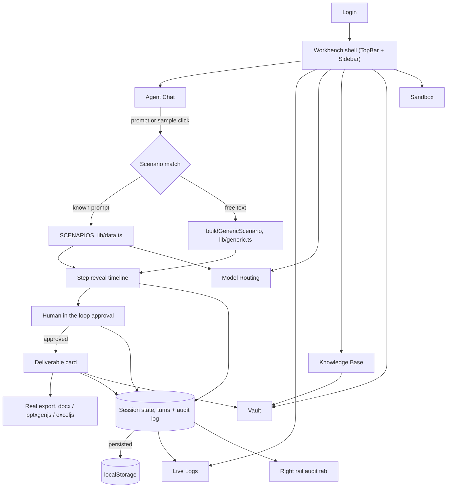

# Rakshaka.AI

An on premises agentic AI workbench, prototyped for Mangalore Refinery and
Petrochemicals Limited under SIH26117. Rakshaka is the Kannada word for
protector: the workbench is built to read, draft and reason over
confidential refinery documents without a single byte leaving the plant
network.

This repository holds the frontend preview: a fully interactive interface
that demonstrates the intended product experience end to end using
realistic, hardcoded scenarios in place of a live model backend. The
composer, agent step trail, human in the loop approval gate, live audit
log, network monitor, model router and knowledge base are all real,
working UI, not static mockups.

## What is demonstrated

- **Document analysis with OCR and vision.** Reads a scanned tank
  inspection report, cross references it against an SOP, and drafts a
  Word approval note. Flags a limit breach and holds the deliverable for
  human sign off.
- **Coding in an isolated sandbox.** A real Cursor style IDE, explorer
  tree, tabs, integrated terminal, writes and tests a flare knockout drum
  sizing script against a worked engineering example.
- **Knowledge retrieval with citations.** Answers a policy question
  grounded in an SOP, with exact clause and page references.
- **Spreadsheet analysis and report generation.** Summarizes a quarterly
  HSE incident log into a board ready slide deck plus a companion Excel
  workbook of the underlying figures.
- **Real exports.** Approval notes, slide decks and spreadsheets download
  as genuine .docx, .pptx and .xlsx files, generated client side. Nothing
  is a placeholder.
- **Model routing made visible.** A dedicated page traces exactly how each
  request moved: classified, checked against every candidate model, and
  routed, alongside the full open weight model registry and its licenses.
- **Governance and observability.** A live, auto scrolling activity log,
  a zero external requests network monitor, and a Vault that collects
  every deliverable and every source document touched this session.

Two of the four sample scenarios share the same underlying incident
thread, so the knowledge base graph and the audit trail show how a single
finding threads through more than one deliverable.

## Architecture



The composer resolves each prompt to a scenario, either one of the four
hardcoded walkthroughs or a lightweight generic classifier for anything
else typed in. Every step reveal, approval decision and export writes an
entry to the shared audit log, which both the right rail and the Live
Logs page read from. Deliverables and referenced source documents also
land in the Vault automatically as they are produced.

## Running locally

```bash
npm install
npm run dev
```

Sign in with the Google button on the login screen, this is a UI mock, no
real OAuth call is made. From the workbench, pick a sample prompt or type
your own request. Sample source documents live under `public/sample-files`
and can be attached from the composer or downloaded from the Knowledge
Base panel.

## Stack

React, TypeScript, Vite, Tailwind CSS v4. No backend and no external
network calls. Scenario data lives in `src/lib/data.ts`, real file
generation is handled client side by `docx`, `pptxgenjs` and `exceljs`,
all lazy loaded only when an export is triggered.
